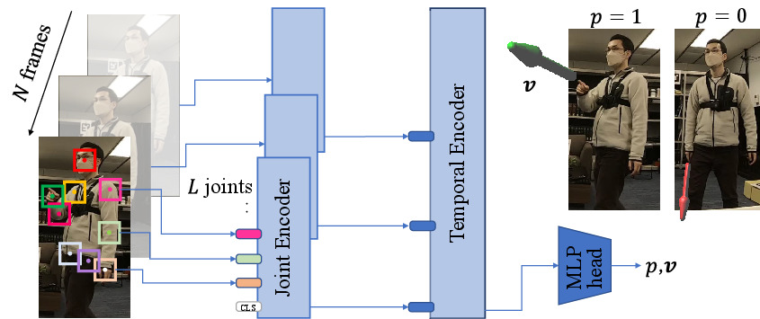
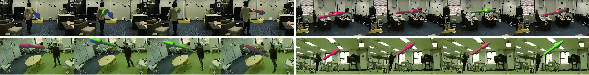

# DeePoint: Visual Pointing Recognition and Direction Estimation, ICCV 2023

This repository provides an implementation of our paper [DeePoint: Visual Pointing Recognition and Direction Estimation]() in ICCV 2023. If you use our code and data please cite our paper.

Please note that this is research software and may contain bugs or other issues – please use it at your own risk. If you experience major problems with it, you may contact us, but please note that we do not have the resources to deal with all issues.


```
@InProceedings{Nakamura_2023_ICCV,
	author    = {Shu Nakamura and Yasutomo Kawanishi and Shohei Nobuhara and Ko Nishino},
	title     = {DeePoint: Visual Pointing Recognition and Direction Estimation},
	booktitle = {Proceedings of the IEEE/CVF International Conference on Computer Vision (ICCV)},
	month     = {October},
	year      = {2023},
}
```



## Prerequisites
We tested our code with `python3.10` with external libraries including:
- `numpy`
- `opencv-python`
- `opencv-contrib-python`
- `torch`
- `torchvision`
- `pytorch-lightning`

Please refer to [environment/pip_freeze.txt](environment/pip_freeze.txt) for the specific versions we used.  
You can also use `singularity` to replicate our environment:
```bash
singularity build environment/deepoint.sif environment/deepoint.def
singularity run --nv environment/deepoint.sif
```

## Usage

### Demo
You can download the pretrained model from [here]().
Download it and save the `.ckpt` file as `models/weight.ckpt`.

You can apply the model on your video and visualize the result by running the script below.
```
python src/demo.py movie=./demo/example.mp4 lr=l ckpt=./models/weight.ckpt
```
- The video has to contain one person within the frame and the person had better shows the whole body in the frame.
- You need to specify the pointing hand (left or right) for visualization.
- Since this script uses OpenGL (`PyOpenGL` and `glfw`) to draw an 3D arrow, you need to have an window system for this to work.
	- We use the script that were used in [Gaze360](https://github.com/erkil1452/gaze360) for drawing 3D arrows.

### DP Dataset



You can download the DP Dataset from Google Drive. [link](https://drive.google.com/drive/folders/1W_49HId_2FLFH0X9Ry8QiTTyaVt2Y0ks)

#### License
The DP Dataset is distributed under the [Creative Commons Attribution-Noncommercial 4.0 International License (CC BY-NC 4.0)](https://creativecommons.org/licenses/by-nc/4.0/).

#### Training with the DP Dataset
After downloading the dataset, follow the instructions in [data/README.md](data/README.md).
The structure of `data` directory then should look like below:
```
deepoint
├── data
│   ├── README.md
│   ├── mount_frames.sh
│   ├── frames
│   │   ├── 2023-01-17-livingroom
│   │   └── ...
│   ├── labels
│   │   ├── 2023-01-17-livingroom
│   │   └── ...
│   └── keypoints
│       ├── collected_json.pickle
│       └── triangulation.pickle
└── ...
```
After downloading the dataset, run
```
python src/main.py task=train
```
to train the model. Refer to `conf/model` for configurations of the model.

#### Evaluation with the DP Dataset
After training, you can evaluate the model by running:

```
python src/main.py task=test ckpt=./path/to/the/model.ckpt
```
